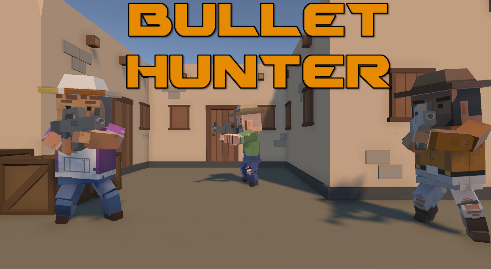
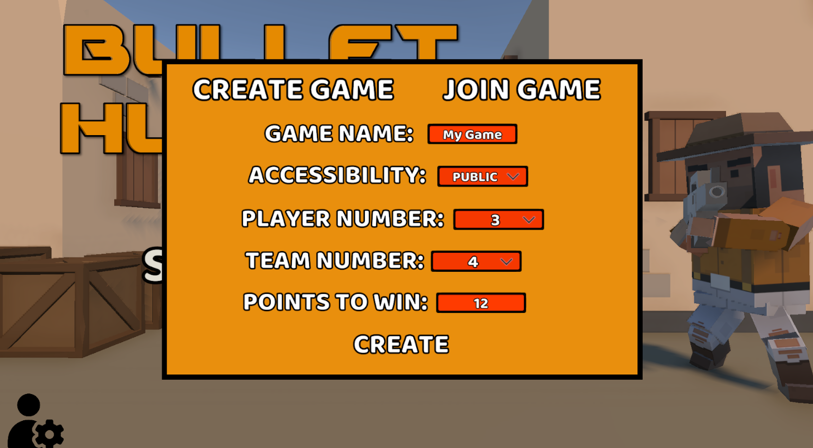
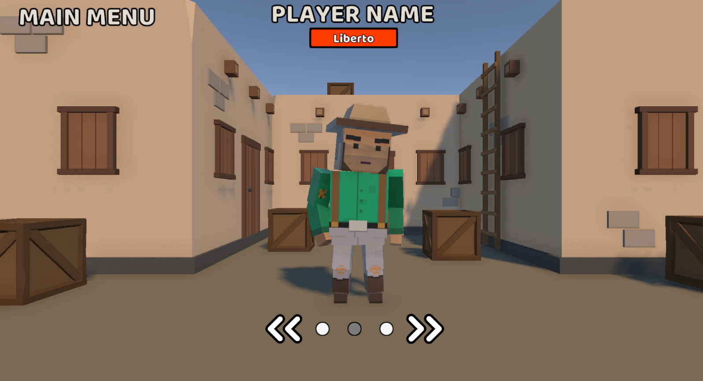
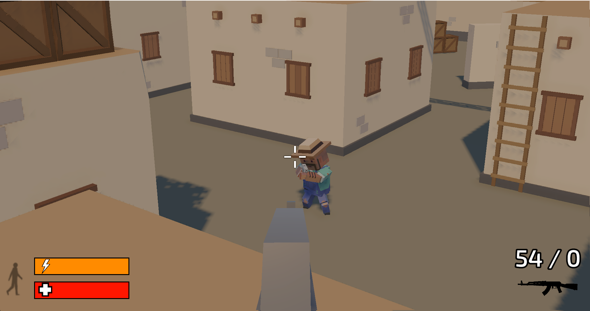
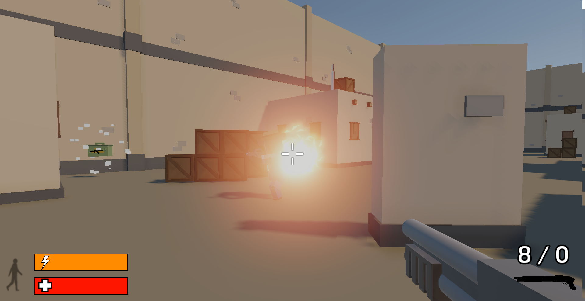
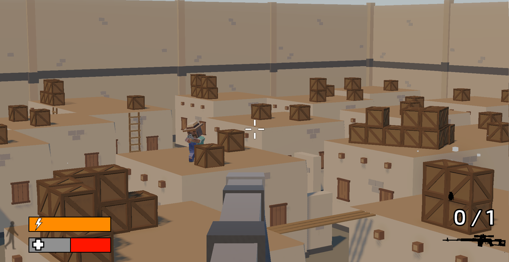
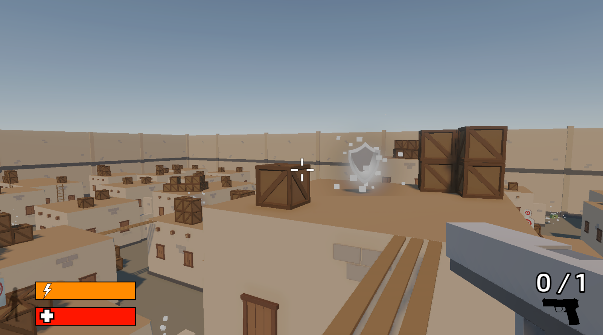

Bullet Hunter is an amazing multiplayer first person shooter game. You can invite your friends to join the fun and together create a team that will compete against other teams in dynamic battles. Step into the role of a chosen soldier and earn points for your team.

<b>Itch:<b> https://libertox.itch.io/bullet-hunter  

# Main Features

## Creating Custom Lobbies

Players can create or join existing lobbies where they start playing with other players. Lobbies allow for setting rules.

## Character Customization

Each player can choose skin and name for your character.

## Weapon System

 Players have access to various types of weapons, such as pistols, rifles, shotguns, sniper rifles and grenades.

 ## Player Boosts

Players can collect boosts to enhance their abilities for a limited time.

 
